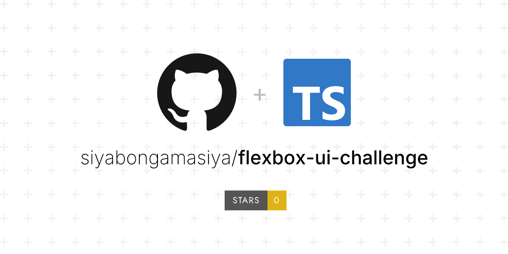

# 🎨 Flexbox UI Challenge

This project is a **React + Flexbox layout challenge**, built to practice creating complex UI structures using only **flexbox** for alignment and positioning.

It showcases:

- 📦 Custom reusable components (`Circle`, `Square`, `Rectangle`)
- 🎯 Nested flex containers with different directions (`row` and `column`)
- 🖼️ A responsive full-page layout using `100vh` height and proportional widths/heights
- 🚀 A clean and modern structure styled with inline styles + CSS reset

---

## 📂 Project Structure

flexbox-ui-challenge/
├── src/
│ ├── components/
│ │ └── components.tsx # Shape components (Circle, Square, Rectangle)
│ ├── App.tsx # Main layout built with flexbox
│ ├── App.css # Base styles and global reset
│ └── index.tsx # Entry point
└── README.md


---

## 🛠️ Technologies Used

- ⚛️ React 18 (with Vite)
- 🎨 CSS + inline styles
- 📐 Flexbox (no CSS grid used — flexbox only!)

---

## 📥 Installation & Setup

1. **Clone the repository**
   ```bash
   git clone https://github.com/siyabongamasiya/flexbox-ui-challenge.git
   cd flexbox-ui-challenge

2. **Install dependencies**
npm install

3. **Start the development server**
npm run dev

4. **Open your browser and go to**
http://localhost:5173

# How It Works

The layout is made entirely with flexbox (display: flex, flex-direction, flex-wrap, align-items, etc.).

Components (Circle, Square, Rectangle) accept props for color, width, and height.

The page is split into sections (60% top, 20% middle, 20% bottom), each styled with flexbox.

# ScreemShort


# Future ideas
-Add more shape types (triangle, hexagon, etc.)

-Make it responsive for smaller screens

-Add animations (hover effects, transitions)